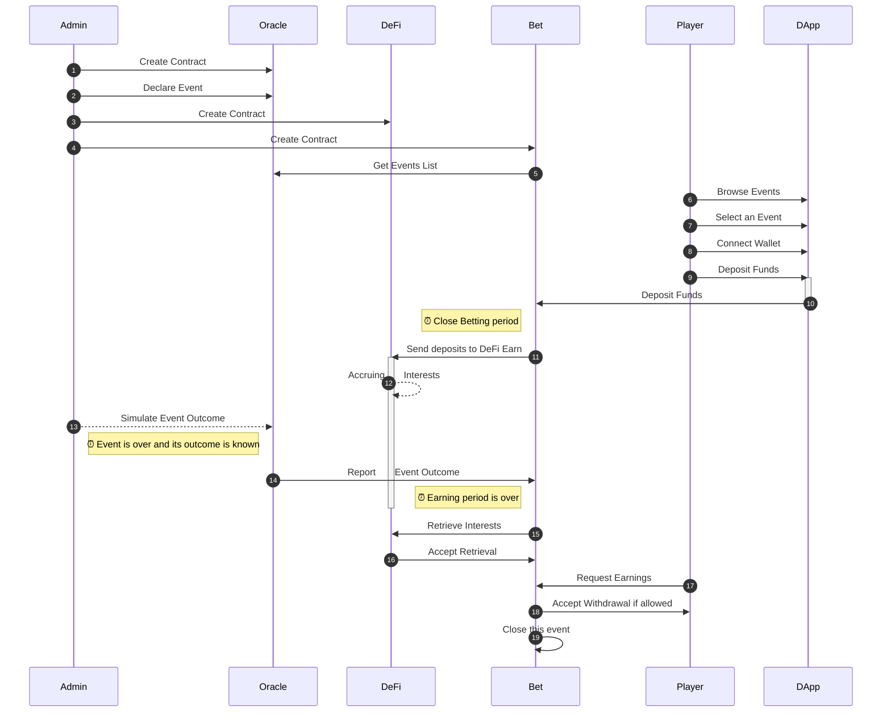

[](https://github.com/bet-no-loss/bet-no-loss/actions/workflows/compile_mermaid.yml)
[](https://github.com/bet-no-loss/bet-no-loss/actions/workflows/extract_client.yml)
[](https://dashboard.heroku.com/apps/bet-no-loss)
 [](https://bet-no-loss.herokuapp.com/)

# Bet-no-loss

> Bet on a sport event without loosing your stake and get rewarded if you win.
 
## Description

- Players bet on a sport event during week 1.  
- The total amount of bets (all players included) is then staked in DeFi during week 2.  
- Finally at the end of week 3, 90% of accrued interests can be split between winners according to their share in the total deposit value. 
Each winner can then withdraw the 90% accrued interests in DeFi proportionally to his/her initial stake.


## Links

* [Open Application](https://bet-no-loss.herokuapp.com/)
* [Presentation](https://docs.google.com/presentation/d/1HCxnNpTpJYLMGsOCu0hRTsVv7Z5x4cg-bcDrq56NjBc)
* [Wireframes](https://app.diagrams.net/#G1tXstsevdC_w0BXNJh9pAyF5CtaAM2az-)
* [Github](https://github.com/bet-no-loss/bet-no-loss/) (this repository: code, issues, wiki)

## Features

### Architecture

Bet-no-loss software is composed of 2 parts:
- **Back-End**:  The **Ethereum smart-contracts** deployed on the testnets. They are written in Solidity.
- **Front-End**: A **ReactJS client** deployed on Heroku. It  provides the User Interface to interact with the contracts.

This Github **repository** is a **monorepo** that entails **both** the **back-end and** the **front-end** code.

### Smart-Contracts

- `BetOracle` denotes a *simulated* smart-contract that:
    - registers events
    - provides the events list
    - Get the outcome of registered events
    - provides the outcome of an event when asked for
- `DeFiPool` denotes a *simulated* smart-contract in charge of simulating a DeFi protocol that accepts deposits and allow withdrawal with accrued interests.
- `Bet` The betting contract in charge of:
    - handling the bets: deposit/withdrawal
    - getting the list of events from *Oracle*
    - sending all deposits for a given bet to *DeFi* to earn
    - withdraw and get accrued interests from `DeFiPool`
    - Allow winners to withdraw their prizes
    - Allow all players to withdraw their stake

### Interactions

The below diagram outlines the interactions occurring between the smart-contracts involved.

`Admin` is not a contract but denotes the user that deploys the smart-contracts.

<!-- generated by mermaid compile action - START -->

<details>
  <summary>Mermaid markup</summary>



</details>
<!-- generated by mermaid compile action - END -->


# Installation

Installing **locally** is a 2 steps process:
- Install `nodejs` and`npm`
- Clone the repository:
```
cd $DEV

# ~~~ Clone the repository
git clone git@github.com:bet-no-loss/bet-no-loss.git
cd bet-no-loss
```
- Install the `npm` packages for the back-end and the front-end
```
// ~~ Update npm to its latest version
npm install -g npm

# ~~~ Install the npm packages for the back-end
npm install

# ~~~ Install the npm packages for the front-end
npm --prefix client/ install
```

# Configuration

# Install Solidity Compiler

Install Solidity Compiler version `0.8.3`.
 
## Define Environment Parameters

As a dev, in order to use the project locally and deploy the smart contracts you need to **create a `.env` file** in the project' root folder.
It contains the environment specific parameters for the test and main networks.

- Create a `.env` file in the project's root folder  
- Edit `.env` and set the below `property = "value"` pairs (one per line):
```
MNEMONIC          = "TODO_enter_your_own_12_words_seed_here"
INFURA_PROJECT_ID = "TODO_infura_project_id_here"
```

ℹ️ Keep in mind to surround each value with double quotes.

## Configure Heroku

- [Download and install Heroku CLI](https://devcenter.heroku.com/articles/heroku-cli#download-and-install).  
  We use the Heroku Command Line Interface to change the Heroku configuration of our app or tune things up.  
  Once configured, the deployment occurs all by itself without manual intervention.
- **Configure Heroku CLI**  
You need to do this once only for the Heroku app owner only (as you use the free plan).
```
heroku login
heroku add:keys
```
- **Create** your **App** on Heroku  
    - **App Name**: To keep things simple give your Heroku app the same name as your Github project.
    - **Github**: When asked enter the Github user and repository names of your project
    - **Buildpacks**: Select **`mars/create-react-app`** and remove any other buildpack (Important: Remove NodeJs if present as `mars/create-react-app` already takes care of this)
- Configure Heroku to **automatically deploy** the **project** from the **`client` branch**  
    - [Open the Heroku Dashboard](https://dashboard.heroku.com/apps/) in your web browser
    - Choose your app
    - Click the `Deploy` tab
        - **`Deployment Method`**: Select **`Github`** as the 
        - **`App connected to GitHub`**:  Select your **Github project** then select the **`client` branch**
        - **`Automatic Deploys`**: Activate automatic deploys from `client`.  
        If this branch does not exist yet, you  need to install this [Github Workflow Action](https://github.com/bet-no-loss/bet-no-loss/blob/master/.github/workflows/extract_client.yml) (handcrafted with 💙) in your local repository beforehand.  
        Then push to `master` and this action will do its magic.
- Configure Heroku in the **local git repository**
```
cd $DEV
# git clone git@github.com:bet-no-loss/bet-no-loss.git
cd bet-no-loss

# Declare the heroku git remote repository
heroku git:remote --ssh-git -a bet-no-loss

# Use the `mars/create-react-app`buikdpack to deploy and start the ReactJS app
#   Not needed as we have already done that via the Web UI before. 
#   This how to do the same thing using the command line interface.
#heroku buildpacks:clear
#heroku buildpacks:set mars/create-react-app

# Set config variables
#heroku config:set USE_NPM_INSTALL=true
heroku config:set NPM_CONFIG_PRODUCTION=true 
```

# Compile

```
npx truffle compile # --all
```

# Test

Run ganache on port 9545.

```
npx truffle test # Run the unit and integration tests

npx truffle deploy --reset --network ganache
```

# Deploy 

You need to deploy both the smart-contracts and the ReactJS client (DApp).

## Deploy the Smart-Contracts

```
# Local Deploy
npx truffle deploy --reset --network=ganache

# Remote Deploy on XXX test network
npx truffle deploy --reset --network=XXX
```

## Deploy the DApp

Our **DApp** is **Front-End** application written in **ReactJS**.  
There is no need to deploy it **locally.

It is also **deployed automatically on [Heroku](https://heroku.com)** each time there is a push to the `master` branch.

To achieve Continuous Deployment to Heroku we developed and configured a 2 steps process involving both a Github workflow and a Heroku deploy.

**Github Workflow**  
First off, we built a **[Github Workflow Action](https://github.com/bet-no-loss/bet-no-loss/blob/master/.github/workflows/extract_client.yml)** triggered each time the `master` branch is pushed.  
It extracts **only the commits that touched the `client/`** folder  (RectJS section of the project) and store them in a dedicated and custom built branch named `client`.
This way we end up with a branch that exclusively contains the client code located in the root folder instead of the `client/ folder as usual.

**Why**?    
This is due to a deployment constraint of the Heroku[mars/create-react-app-buildpack](https://elements.heroku.com/buildpacks/mars/create-react-app-buildpack) that we use for deployment.
This [buildpack](https://github.com/mars/create-react-app-buildpack/blob/master/README.md) **requires our ReactJS app** to reside **in the** project's **root folder**. However, this is not the case on `master` as the client code lives in the `/client/` folder.  
We created a workflow action to do this magic.
It creates a `client` branch out of `master` with exclusively the **client code** and makes sure it is **located in the project's root folder** but only for this branch of course.

**Heroku**  
We then configured **Heroku** to listen for changes on the Github repository so that each **push to the **`client`** branch on Github triggers a Heroku deploy**.  
Please do note that this is `client` not `master`.  
Heroku then pulls this branch, deploys and start the ReactJS app. 

# Run the DApp

## Run Locally

In order to run the Front-End application on you local machine:
```
cd client 
npm start
```

## Run on Heroku

[Click this link to open the DApp on Heroku](https://bet-no-loss.herokuapp.com/).


# Documentation

Each smart-contract is documented in a Markdown file in `client/src/contracts`.

Should you need to update the documentation, simply run:
```
npx leafleth -s contracts
```

## Decisions

- Crypto-currency used: DAI
- DeFi Service used: For now none, due to time constraints we will stub them. Later on: Compound or AAVE ?
- No Back-Office for now.  
  As we focus only on having a running project with smart contract + front-office.
  This means in order to add events the owner calls the ad-hoc smart-contract's functions.

