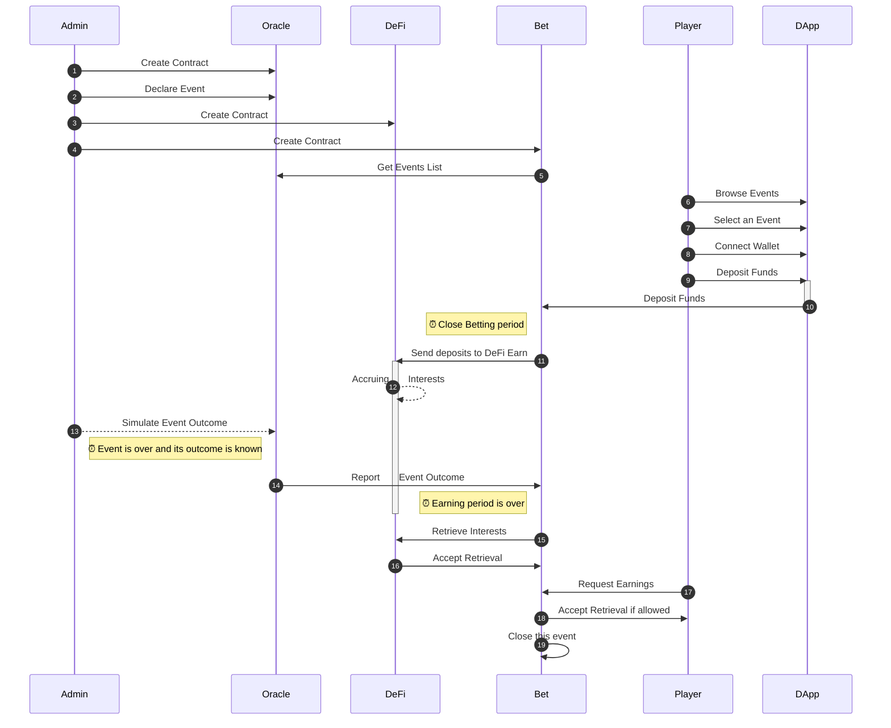

[](https://github.com/bet-no-loss/bet-no-loss/actions/workflows/compile_mermaid.yml)
 
 [](https://docs.openzeppelin.com/)
 
# Bet-no-loss

> Tagline: Bet on a sport event without loosing your stake and get rewarded if you win.
 
## Description

- Players bet on a sport event during week 1.  
- The total amount of bets (all players included) is then staked in DeFi during week 2.  
- Finally at the end of week 3, 90% of accrued interests can be split between winners according to their share in the total deposit value. 
Each winner can then withdraw the 90% accrued interests in DeFi proportionally to his/her initial stake.


## Links

* [Presentation](https://docs.google.com/presentation/d/1HCxnNpTpJYLMGsOCu0hRTsVv7Z5x4cg-bcDrq56NjBc)
* [Wireframes](https://app.diagrams.net/#G1tXstsevdC_w0BXNJh9pAyF5CtaAM2az-)
* [Github](https://github.com/bet-no-loss/bet-no-loss/)
* [DaPP Heroku](https://bet-no-loss.herokuapp.com/)
* [Trello](https://trello.com/b/c6Xhe5hM)
* [Google Drive](https://drive.google.com/drive/folders/1Pr22-VTGNVREl7AUdPy1f77OxrgqNvgO)
* [YouTube Playlist](https://www.youtube.com/playlist?list=PLNwicjhsnUEooeRnNgrkV0TH6m21F3jpA) 

## Features

TODO


# Install

```
cd $DEV

git clone git@github.com:bet-no-loss/bet-no-loss.git
cd bet-no-loss
```

# Configure

```
npm install
```

In order to deploy to the test networks or the main network you need to:

- Create a `.env` file in the project's home folder  
- Edit `.env` and set the below `property = "value"` pairs (one per line):

```
MNEMONIC          = "TODO_enter_your_own_12_words_seed_here"
INFURA_PROJECT_ID = "TODO_infura_project_id_here"
```

Keep in mind to surround each value with double quotes.

# Compile

```
truffle compile
```

# Run

TODO


# Test

Run ganache on port 7545.

```
truffle compile
truffle deploy --reset --network ganache
```
TODO

# Documentation

Each smart-contract is documented in a Markdown file in `client/src/contracts`.

Should you need to update the documentation, simply run:
```
npx leafleth -s contracts
```

## Decisions

- Crypto-currency used: DAI
- DeFi Service used: For now none, due to time constraints we will stub them. Later on: Compound or AAVE ?
- No Back-Office for now.  
  As we focus only on having a running project with smart contract + front-office.
  This means in order to add events the owner calls the ad-hoc smart-contract's functions.

## Interactions Diagram

<!-- generated by mermaid compile action - START -->

<details>
  <summary>Mermaid markup</summary>



</details>
<!-- generated by mermaid compile action - END -->

