[](https://github.com/bet-no-loss/bet-no-loss/actions/workflows/compile_mermaid.yml)
[](https://github.com/bet-no-loss/bet-no-loss/actions/workflows/extract_client.yml)
[](https://github.com/bet-no-loss/bet-no-loss/actions/workflows/build.yml)
[](https://github.com/bet-no-loss/bet-no-loss/actions/workflows/test.yml)
[](https://coveralls.io/github/bet-no-loss/bet-no-loss?branch=master)


[](https://dashboard.heroku.com/apps/bet-no-loss)
 [](#documentation)
[](https://bet-no-loss.herokuapp.com/)


# Bet-no-loss

> Bet on a sport event without loosing your stake and get rewarded if you win.
 
## Description

- Week 1
Players bet on a sport event during week 1.
- Week 2
    - The total amount of bets (all players included) is then staked in DeFi during week 2.  
    - The sport event occurs
    - The oracle makes the event outcome available.
- Week 3
    - Bet-no-loss withdraws the interests accrued in DeFi, substracts the platform fees.
    - The remaining can be split between winners according to their share in the total deposit value.
- Each winner can then withdraw his/her interests proportionally to his/her initial stake.  
- Each player can also withdraw his/her stake.

## Links

* [Whitepaper](https://docs.google.com/document/d/17pnu1nYqquXjo-jIGvSeHCeNQ9_gPBti0XnI7pAoGkw)
* Open Application: [https://bet-no-loss.herokuapp.com/](https://bet-no-loss.herokuapp.com/) (for demo purposes only)
* [Presentation](https://docs.google.com/presentation/d/17AitCSlIVLVsMk5n-se5vEJtA7_i9MJC9PXkDil75a4)
* [Wireframes](https://app.diagrams.net/#G1tXstsevdC_w0BXNJh9pAyF5CtaAM2az-)
* [Doc](doc/)
* [Github](https://github.com/bet-no-loss/bet-no-loss/) (this repository: code, issues, wiki)

## Features

TODO

## Architecture

Bet-no-loss software is composed of 2 parts:
- **Back-End**:  
The **Ethereum smart-contracts** deployed on the testnets. They are written in Solidity.
- **Front-End** (DApp):  
A **ReactJS client app** written in ReactJS and deployed on Heroku. 
It  provides the User Interface to interact with the contracts.

This Github **repository** is a **monorepo** that entails **both** the **back-end and** the **front-end** code.

### Back-End

The back-end is compoosed of the following Ethereum **smart-contracts**:

- [`DAI`](contracts/DAI.sol) TODO 
- [`Bet`](contracts/Bet.sol) The betting contract in charge of:
    - handling the bets: deposit/withdrawal
    - getting the list of events from *Oracle*
    - sending all deposits for a given bet to *DeFi* to earn
    - withdraw and get accrued interests from `DeFiPool`
    - Allow winners to withdraw their prizes
    - Allow all players to withdraw their stake
- [`BetOracle`](contracts/BetOracle.sol) A *simulated* smart-contract that:
    - registers events
    - provides the events list
    - Get the outcome of registered events
    - provides the outcome of an event when asked for
- [`DefiPool`](contracts/DefiPool.sol) A smart-contract in charge of simulating a DeFi protocol that accepts deposits and allow withdrawal with accrued interests.
- [`DateUtil`](contracts/DateUtil.sol) denotes a contract providing helper date handling functions

### Front-End

Our **DApp** is a **Front-End** application written in **ReactJS** and deployed on Heroku.


## Interactions
The below diagrams outline the interactions occurring between the smart-contracts and other stakeholders involved.
- The first diagram provides a **high level** overview of the interactions.  
- The second one is more **detailed** and goes down to the **function calls**.

### Interactions - Overview

The below diagram gives a bird's eye view of the interactions between the smart-contracts.

`Admin` is not a contract but denotes the user that deploys the smart-contracts (owner).

TODO: Add DAI contract

<!-- generated by mermaid compile action - START -->

<details>
  <summary>Mermaid markup</summary>



</details>
<!-- generated by mermaid compile action - END -->


```mermaid
sequenceDiagram autonumber
    participant admin  as Admin 🔧 👱‍♂️
    participant oracle as BetOracle ❓ ⚙️ 
    participant bet    as Bet 🎲 ⚙️
    participant defi   as DefiPool 💰 ⚙️
    participant player as Player 🎲 👱‍♂️
    participant dapp   as DApp 🖥 _ ☁️
    
    rect rgb(238, 238, 238)
        Note over admin,oracle: ℹ️_Initialization Phase
        admin->>oracle: Deploy Contract
        admin->>oracle: Declare Event
        admin->>defi: Deploy Contract
        admin->>bet:  Deploy Contract
    end

    rect rgb(238, 238, 238)
        Note over bet,oracle: ℹ️_Betting Phase
        bet->>oracle:  Get Events List
        oracle->>bet: Send Events List
        player->>dapp: Browse Events
        player->>dapp: Select an Event
        player->>dapp: Connect Wallet

        player->>dapp: Deposit Funds
        activate dapp
        dapp->>bet: Deposit Funds
        deactivate dapp

        Note left of bet: ⏰_Close Betting period
    end

    rect rgb(238, 238, 238)
        bet->>defi: Send deposits to DeFi to earn
        Note over admin,bet: ℹ️_Earning Phase
        activate defi
        defi-->>defi: Accruing    Interests    

        admin-->>oracle: Simulate Event Outcome
        Note left of oracle: ⏰_Event is over and its outcome is known
        oracle->>bet: Report    Event Outcome 

        Note left of bet: ⏰_Earning period is over
        deactivate defi
    end

    rect rgb(238, 238, 238)
        Note over bet,defi: Distribution Phase
        bet->>defi: Retrieve Interests
        defi->>bet: Accept Retrieval

        player->>bet: Request Earnings
        bet->>player: Accept Withdrawal if allowed
    end

    bet->>bet: Close this event 
```

### Interactions - Details

This diagram provides a more **detailed** view of the **interactions** in between the smart-contracts.
It is more developer centric as it mentions the **function** calls.

TODO: Add DAI contract

<!-- generated by mermaid compile action - START -->

<details>
  <summary>Mermaid markup</summary>



</details>
<!-- generated by mermaid compile action - END -->

```mermaid
sequenceDiagram autonumber
    participant admin  as Admin 🔧 👱‍♂️
    participant dapp   as DApp 🖥 _ ☁️
    participant player as Player 🎲 👱‍♂️
    participant bet    as Bet 🎲 ⚙️
    participant oracle as BetOracle ❓ ⚙️ 
    participant defi   as DefiPool 📈 ⚙️
    participant dai    as DAI  ⚙️
    
    rect rgb(238, 238, 238)
        Note over admin,oracle: ℹ️_⚙️_Initialization Phase
        admin->>oracle: Deploy Contract        
        admin->>defi: Deploy Contract
        admin->>dai: Deploy Contract
        admin->>bet:  Deploy Contract
        bet->>bet: constructor(_daiTokenAddress)

        admin->>dapp: Set Oracle Address
        activate dapp
            dapp->>bet: setOracleAddress(_oracle_address)
            bet->>oracle: testConnection()
            alt can connect
                oracle-->>bet: true
                bet-->>dapp:   true
            else cannot connect
                oracle-->>bet: ⚡️
                bet-->>dapp:   ⚡️
            end
        deactivate dapp

        admin->>dapp: Set DeFi Address (TODO)
        activate dapp
            dapp->>bet: setDeFiAddress(_defiAddress)
            bet->>defi: testConnection()
            alt can connect
                defi-->>bet: true
                bet-->>dapp:   true
            else cannot connect
                defi-->>bet: ⚡️
                bet-->>dapp: ⚡️
            end
        deactivate dapp

        admin->>dapp: Declare Event
        activate dapp
            dapp->>oracle: addSportEvent(name, teams, teamCount, date)
            oracle->>dapp: eventId
        deactivate dapp
    end

    rect rgb(238, 238, 238)
        Note over dapp,bet: ℹ️_🎲_ Betting Phase
        dapp->>bet: Get Events List: getBettableEvents()
        activate bet
            bet->>oracle:  getPendingEvents()
            oracle-->>bet: eventId[]
        deactivate bet
        player->>dapp: Browse Events
        player->>dapp: Select an Event
        player->>dapp: Connect Wallet

        player->>dapp: Place Bet with DAIs
        activate dapp
            dapp->>bet: placeBet(_eventId, _chosenWinner) payable
            bet->>bet: Collect the DAIs used to pay the bet into the contract's account
            bet->>bet:  Register this bet
        deactivate dapp

        Note left of bet: ⏰_Close Betting period
    end

    rect rgb(238, 238, 238)
        bet->>defi: Send deposits to DeFi to earn
        Note over admin,bet: ℹ️_📈 _TODO: Earning Phase
        activate defi
        defi-->>defi: Accruing    Interests    

        admin-->>oracle: Simulate Event Outcome
        Note left of oracle: ⏰_Event is over and its outcome is known
        oracle->>bet: Report    Event Outcome 

        Note left of bet: ⏰_Earning period is over
        deactivate defi
    end

    rect rgb(238, 238, 238)
        Note over bet,defi: TODO: Distribution Phase
        bet->>defi: Retrieve Interests
        defi->>bet: Accept Retrieval

        player->>bet: Request Earnings
        bet->>player: Accept Withdrawal if allowed
    end

    bet->>bet: Close this event 
```

# Security
We tried to make our smart-contracts as resistant as possible to common attacks and potential hacks.  
[Read more...](doc/avoiding_common_attacks.md)

# Installation

- Install [`nodejs` and `npm`](https://docs.npmjs.com/downloading-and-installing-node-js-and-npm)
- Install the [Solidity Compiler version `0.8.3`](https://docs.soliditylang.org/en/v0.8.3/installing-solidity.html)
- Clone the Github repository
    ```
    cd $DEV
    
    # ~~~ Clone the repository
    git clone git@github.com:bet-no-loss/bet-no-loss.git
    cd bet-no-loss
    ```
- Install the `npm` packages for the back-end and the front-end
    ```
    # ~~ Update npm to its latest version
    npm install -g npm
    
    # ~~~ Install the npm packages for the back-end
    npm install
    
    # ~~~ Install the npm packages for the front-end
    npm --prefix client/ install
    ```

# Configuration

## Environment Parameters

As a **dev**, in order to deploy the smart contracts and use the project, you need to create a **`.env`** file in the project's root folder.  
It contains the environment specific parameters for the (test) network to deploy to and your project identifier on [Infura](https://infura.io/).

- Create a `.env` file in the project's root folder  
- Edit `.env` and set the below `property = "value"` pairs (one per line):
    ```
    MNEMONIC          = "TODO_enter_your_own_12_words_seed_here"
    INFURA_PROJECT_ID = "TODO_infura_project_id_here"
    ```

ℹ️ Keep in mind to surround each value with double quotes.  

In order to generate per function **gas consumption reports** (optional), simply append the following line to `.env`.
```
    COINMARKETCAP_API_KEY= "TODO_CMC_API_KEY_HERE"
```
You will need a **CoinMarketCap API Key**.  
You can get one [here](https://coinmarketcap.com/api/pricing/).  
Read more to know [how to generate the gas report](#gas-report)


## Heroku Configuration

**This app is already configured on Heroku and Github to deploy the front-end (ReactJS)** each time someone pushes the `master` branch to Github.
**Therefore you don't have to read this section**, lucky you are.

The following explains the steps we took to configure Heroku and Github.  
This may prove useful for some of you with a similar configuration, that is a monorepo (**single** git **repository**) **containing both the back-end (smart-contracts) and the front-end application (DApp)**.  
Conversely, if you have 2 distinct repositories, ie. one for the back-end and one for the front-ent, then things will be way easier for you, simply skip this section and follow the regular [Heroku documentation](https://devcenter.heroku.com) to deploy your front-end. 

- [Download and install Heroku CLI](https://devcenter.heroku.com/articles/heroku-cli#download-and-install).  
  We use the Heroku Command Line Interface to change the Heroku configuration of our app or tune things up.  
  Once configured, the deployment occurs all by itself without manual intervention.
- **Configure Heroku CLI**  

You need to do this once only for the Heroku app owner only (as you use the free plan).
    ```
    heroku login
    heroku add:keys
    ```
- **Create** your **App** on Heroku  
    - **App Name**: To keep things simple give your Heroku app the same name as your Github project.
    - **Github**: When asked enter the Github user and repository names of your project
    - **Buildpacks**: Select **`mars/create-react-app`** and remove any other buildpack (Important: Remove NodeJs if present as `mars/create-react-app` already takes care of this)
- Configure Heroku to **automatically deploy** the **project** from the **`client` branch**  
    - [Open the Heroku Dashboard](https://dashboard.heroku.com/apps/) in your web browser
    - Choose your app
    - Click the `Deploy` tab
        - **`Deployment Method`**: Select **`Github`** as the 
        - **`App connected to GitHub`**:  Select your **Github project** then select the **`client` branch**
        - **`Automatic Deploys`**: Activate automatic deploys from `client`.  
        If this branch does not exist yet, you  need to install the [`extract_client.yaml`](https://github.com/bet-no-loss/bet-no-loss/blob/master/.github/workflows/extract_client.yml) Github Workflow Action (handcrafted with 💙 with a lot upfront research) in your local repository beforehand.  
        Then push to `master` and this action will do its magic.
- Configure Heroku in the **local git repository**
    ```
    cd $DEV
    # git clone git@github.com:bet-no-loss/bet-no-loss.git
    cd bet-no-loss

    # Declare the heroku git remote repository
    heroku git:remote --ssh-git -a bet-no-loss

    # Use the `mars/create-react-app`buikdpack to deploy and start the ReactJS app
    #   Not needed as we have already done that via the Web UI before. 
    #   This how to do the same thing using the command line interface.
    #heroku buildpacks:clear
    #heroku buildpacks:set mars/create-react-app

    # Set config variables
    #heroku config:set USE_NPM_INSTALL=true
    heroku config:set NPM_CONFIG_PRODUCTION=true 
    ```

# Compile

```
npx truffle compile # --all
```

# Test

[This page](doc/tests_explication.md) explains **what we test and how**.

```
# Run ganache on port 9545 beforehand
npx truffle deploy --reset --network ganache

npx truffle test # Run the unit and integration tests
```

# Code Coverage

```
npm run coverage
```
Runs the tests then displays a report of the smart-contracts code coverage.

How does it work?  
Running the coverage report, first runs the tests and generate a coverage report file in the end.
This file contains a breakdown of the contracts/functions/lines executed while running the tests. As this file is difficult to digest for human, we push it to an external service named [`coveralls.io`](https://coveralls.io/github/bet-no-loss/bet-no-loss?branch=master) that digests it in one swoop and provides a User Interface to easily navigate the report.

# Gas Report

To get a report of the gas consumed by the smart-contracts while running the tests.
```
npm run gas
```

Read more about the [eth-gas-reporter](https://github.com/cgewecke/eth-gas-reporter) npm package we use to generate gas reports.


# Deploy 

You need to deploy both the smart-contracts (back-end) and the ReactJS app - DApp (front-end).

## Deploy Back-End

The **smart-contracts** are deployed in the following order:  
1. `DAI`
2. `Bet`
3. `BetOracle`
4. `DateLib`
5. `DeFiPool`


### Deploy Dev
```
# Local Deploy
npx truffle deploy --network=ganache
```

### Deploy on a Test Network
```
# Deploy the contracts on the ropsten test network
npx truffle deploy --network=ropsten
```

Update the contract addresses in the file [`doc/deployed_addresses.md`](doc/deployed_addresses.md).

### Contracts Addresses

The file **[`doc/deployed_addresses.md`](doc/deployed_addresses.md)** contains the address of each smart-contract deployed on the Ropsten testnet.

## Deploy Front-End

**Local Deployment**:  
Nothing to do.

**Remote Deployment**:   
The DApp is **deployed automatically on [Heroku](https://heroku.com)** each time there is a push to the `master` branch.

> To achieve Continuous Deployment to Heroku we developed and configured a 2 steps process involving both a Github workflow and a Heroku deploy.
> 
> First-off, make sure you have [configured Heroku](README.md#heroku-configuration) beforehand.
> 
> **Github Workflow**  
> First off, we built a **[Github Workflow Action](https://github.com/bet-no-loss/bet-no-loss/blob/master/.github/workflows/extract_client.yml)** triggered each time the `master` branch is pushed.  
> It extracts **only the commits that touched the `client/`** folder  (ReactJS section of the project) and store them in a dedicated and custom built branch named `client`.
> This way we end up with a branch that exclusively contains the client code located in the root folder instead of the `client/ folder as usual.
> 
> **Why**?    
> This is due to a constraint of the Heroku [mars/create-react-app-buildpack](https://elements.heroku.com/buildpacks/mars/create-react-app-buildpack) that we use for deployment.
> This [buildpack](https://github.com/mars/create-react-app-buildpack/blob/master/README.md) **requires our ReactJS app** to reside **in the** project's **root folder**. However, this is not the case as on `master` the client code lives in the `/client/` folder.  
> We created a workflow action to do this magic.
> It creates a `client` branch out of `master` with exclusively the **client code** and makes sure all the client code is **located in the project's root folder** but for this branch only of course.
> 
> **Heroku**  
> We then configured **Heroku** to listen for changes on the Github repository so that each **push to the **`client`** branch on Github triggers a deploy to Heroku**.  
> Heroku then pulls the `client` branch (not `master`) then deploys and starts the ReactJS app. 

**Another option** (not the one we took though) would be to deploy to Heroku **on demand**, and do so using the heroku command line interface (`heroku` CLI), like so:
```
git checkout master

# Pushes the commits related to the `client/` folder to the master branch on the remote git repository named heroku
git subtree push --prefix client/ heroku master
```
In this case, Heroku needs to be configured to use the **Heroku CLI** deployment method and listen for changes on the `master` branch.

# Run

- Run the **local** DApp:  
In order to run the Front-End application on your local machine:
    ```
    cd client 
    npm start
    ```

# Open the App

- Open the **local** DApp: https://localhost:3000/ 
- Open the DApp deployed on **Heroku (remote)**:  https://bet-no-loss.herokuapp.com/ (to interact with the contracts deployed on a TestNet)

# Documentation

[Read the smart-contracts' documentation](doc/contracts).

Should you need to update the documentation, simply run:
```
npx run build-doc
```
This generates a markdown file for each smart-contract in the [`doc/contracts`](doc/contracts) folder.


# Decisions

- Crypto-currency used: DAI
- DeFi Service used: For now none, due to time constraints we will stub them. Later on: Compound or AAVE ?
- No Back-Office for now.  
  As we focus only on having a running project with smart contract + front-office.
  This means in order to add events the owner calls the ad-hoc smart-contract's functions.

[This document](doc/design_pattern_decisions.md) list other design decisions we made.

# Credits

Bet-no-loss is [@Tantely](https://github.com/Tanteli)'s idea.

# Contributors

- Project Managers
    - [Diane Paya-Monet](https://www.linkedin.com/in/diane-paya-monet/)
    - Mohamed Frihat
- Devs
    - [@Tantely](https://github.com/Tanteli)
    - [@Lebeil](https://github.com/Lebeil)
    - Eric Bouchut [Github](https://github.com/ebouchut) [LinkedIn](https://linkedin.com/in/ebouchut)

# License

*[Bet-no-loss](https://github.com/bet-no-loss/bet-no-loss)* is released under the terms of the MIT license.  
See COPYING for more information or https://opensource.org/licenses/MIT .

# Sources
Here are a few links to resources that we used while building bet-no-loss.
- Ethereum
    - [Ethereum Developer's Tools](https://github.com/ConsenSys/ethereum-developer-tools-lis)
- Solidity
    - https://docs.soliditylang.org/en/v0.8.3
    - [@openzeppelin/contracts](https://docs.openzeppelin.com/contracts)
    - [Solidity Patterns](https://fravoll.github.io/solidity-patterns/)
    - [The Hitchhiker’s Guide to Smart Contracts in Ethereum](https://blog.openzeppelin.com/the-hitchhikers-guide-to-smart-contracts-in-ethereum-848f08001f05/)
- Security
    - [Security Hacks](https://solidity-by-example.org/)
    - [Solidity Best Practices for Smart Contract Security](https://consensys.net/blog/developers/solidity-best-practices-for-smart-contract-security/)
- [Truffle](https://www.trufflesuite.com/docs/truffle) The Swiss Army Knife for smart-contracts creation, build and deployment.
- [Ganache](https://www.trufflesuite.com/ganache) Local Dev/Test Blockchain
- Test
    - https://dzone.com/articles/a-few-tips-for-unit-testing-ethereum-smart-contrac ⭐️
    - https://medium.com/coinmonks/testing-solidity-with-truffle-and-async-await-396e81c54f93
    - https://dzone.com/articles/a-few-tips-for-unit-testing-ethereum-smart-contrac
    - [@openzeppelin/test-helpers](https://docs.openzeppelin.com/test-helpers/)
    - [Chai](https://www.chaijs.com/) TDD assertion library
    - [Mocha](https://mochajs.org/) Test Framework
- Web3
    - https://web3js.readthedocs.io/
- Git
    - git subtree
        - https://www.atlassian.com/git/tutorials/git-subtree
        - https://lostechies.com/johnteague/2014/04/04/using-git-subtrees-to-split-a-repository/
        - https://medium.com/@porteneuve/mastering-git-subtrees-943d29a798ec#.3qcvltsof        
- Continous Integration:
    - [gas report, code coverage](https://ethereum.org/it/developers/tutorials/solidity-and-truffle-continuous-integration-setup/)
- Github
    - [Badges](https://shields.io/) See the wall of badges at the top of this README. This site is such a great resource to build them and a source of inspiration to build custom ones ;-)
