[](https://github.com/bet-no-loss/bet-no-loss/actions/workflows/compile_mermaid.yml)
[](https://github.com/bet-no-loss/bet-no-loss/actions/workflows/extract_client.yml)
[](https://github.com/bet-no-loss/bet-no-loss/actions/workflows/test.yml)
[](https://dashboard.heroku.com/apps/bet-no-loss)
 [](#documentation)
[](https://bet-no-loss.herokuapp.com/)


# Bet-no-loss

> Bet on a sport event without loosing your stake and get rewarded if you win.
 
## Description

- Players bet on a sport event during week 1.  
- The total amount of bets (all players included) is then staked in DeFi during week 2.  
- Finally at the end of week 3, 90% of accrued interests can be split between winners according to their share in the total deposit value. 
Each winner can then withdraw the 90% accrued interests in DeFi proportionally to his/her initial stake.

## License

*Bet-no-loss* is released under the terms of the MIT license. See COPYING for more information or see https://opensource.org/licenses/MIT.

## Links

* [Open Application](https://bet-no-loss.herokuapp.com/)
* Whitepaper
* [Presentation](https://docs.google.com/presentation/d/1HCxnNpTpJYLMGsOCu0hRTsVv7Z5x4cg-bcDrq56NjBc)
* [Wireframes](https://app.diagrams.net/#G1tXstsevdC_w0BXNJh9pAyF5CtaAM2az-)
* [Github](https://github.com/bet-no-loss/bet-no-loss/) (this repository: code, issues, wiki)

## Architecture

Bet-no-loss software is composed of 2 parts:
- **Back-End**:  
The **Ethereum smart-contracts** deployed on the testnets. They are written in Solidity.
- **Front-End** (DApp):  
A **ReactJS client app** written in ReactJS and deployed on Heroku. 
It  provides the User Interface to interact with the contracts.

This Github **repository** is a **monorepo** that entails **both** the **back-end and** the **front-end** code.

### Back-End

The back-end is compoosed of the following Ethereum **smart-contracts**:

- `[DAI](contracts/DAI.sol)` TODO 
- `[Bet](contracts/Bet.sol)` The betting contract in charge of:
    - handling the bets: deposit/withdrawal
    - getting the list of events from *Oracle*
    - sending all deposits for a given bet to *DeFi* to earn
    - withdraw and get accrued interests from `DeFiPool`
    - Allow winners to withdraw their prizes
    - Allow all players to withdraw their stake
- `[BetOracle](contracts/BetOracle.sol)` A *simulated* smart-contract that:
    - registers events
    - provides the events list
    - Get the outcome of registered events
    - provides the outcome of an event when asked for
- `[DefiPool](contracts/DefiPool.sol)` A smart-contract in charge of simulating a DeFi protocol that accepts deposits and allow withdrawal with accrued interests.
- `[DateUtil](contracts/DateUtil.sol)` denotes a contract providing helper date handling functions

### Front-End

Our **DApp** is **Front-End** application written in **ReactJS** and deployed on Heroku.

## Features

TODO

## Interactions
The below diagrams outlines the interactions occurring between the smart-contracts and other satakeholders involved.
- The first diagram provides a **high level** overview of the interactions.  
- The second one is more **detailed** and goes down to the **function calls**.

### Interactions - Overview

The below diagrams gives a bird's eye view of the interactions between the smart-contracts.

`Admin` is not a contract but denotes the user that deploys the smart-contracts (owner).

TODO: Add DAI contract

<!-- generated by mermaid compile action - START -->

<details>
  <summary>Mermaid markup</summary>



</details>
<!-- generated by mermaid compile action - END -->


```mermaid
sequenceDiagram autonumber
    participant admin  as Admin 🔧 👱‍♂️
    participant oracle as BetOracle ❓ ⚙️ 
    participant bet    as Bet 🎲 ⚙️
    participant defi   as DefiPool 💰 ⚙️
    participant player as Player 🎲 👱‍♂️
    participant dapp   as DApp 🖥 _ ☁️
    
    rect rgb(238, 238, 238)
        Note over admin,oracle: ℹ️_Initialization Phase
        admin->>oracle: Deploy Contract
        admin->>oracle: Declare Event
        admin->>defi: Deploy Contract
        admin->>bet:  Deploy Contract
    end

    rect rgb(238, 238, 238)
        Note over bet,oracle: ℹ️_Betting Phase
        bet->>oracle:  Get Events List
        oracle->>bet: Send Events List
        player->>dapp: Browse Events
        player->>dapp: Select an Event
        player->>dapp: Connect Wallet

        player->>dapp: Deposit Funds
        activate dapp
        dapp->>bet: Deposit Funds
        deactivate dapp

        Note left of bet: ⏰_Close Betting period
    end

    rect rgb(238, 238, 238)
        bet->>defi: Send deposits to DeFi to earn
        Note over admin,bet: ℹ️_Earning Phase
        activate defi
        defi-->>defi: Accruing    Interests    

        admin-->>oracle: Simulate Event Outcome
        Note left of oracle: ⏰_Event is over and its outcome is known
        oracle->>bet: Report    Event Outcome 

        Note left of bet: ⏰_Earning period is over
        deactivate defi
    end

    rect rgb(238, 238, 238)
        Note over bet,defi: Distribution Phase
        bet->>defi: Retrieve Interests
        defi->>bet: Accept Retrieval

        player->>bet: Request Earnings
        bet->>player: Accept Withdrawal if allowed
    end

    bet->>bet: Close this event 
```

### Interactions - Details

This diagram provides a more **detailed** view of the **interactions** in between the smart-contracts.
It is more developer centric as it mentions the **function** calls.

TODO: Add DAI contract

<!-- generated by mermaid compile action - START -->

<details>
  <summary>Mermaid markup</summary>



</details>
<!-- generated by mermaid compile action - END -->


```mermaid
sequenceDiagram autonumber
    participant admin  as Admin 🔧 👱‍♂️
    participant dapp   as DApp 🖥 _ ☁️
    participant player as Player 🎲 👱‍♂️
    participant bet    as Bet 🎲 ⚙️
    participant oracle as BetOracle ❓ ⚙️ 
    participant defi   as DefiPool 📈 ⚙️
    participant dai    as DAI  ⚙️
    
    rect rgb(238, 238, 238)
        Note over admin,oracle: ℹ️_⚙️_Initialization Phase
        admin->>oracle: Deploy Contract        
        admin->>defi: Deploy Contract
        admin->>dai: Deploy Contract
        admin->>bet:  Deploy Contract
        bet->>bet: constructor(_daiTokenAddress)

        admin->>dapp: Set Oracle Address
        activate dapp
            dapp->>bet: setOracleAddress(_oracle_address)
            bet->>oracle: testConnection()
            alt can connect
                oracle-->>bet: true
                bet-->>dapp:   true
            else cannot connect
                oracle-->>bet: ⚡️
                bet-->>dapp:   ⚡️
            end
        deactivate dapp

        admin->>dapp: Set DeFi Address (TODO)
        activate dapp
            dapp->>bet: setDeFiAddress(_defiAddress)
            bet->>defi: testConnection()
            alt can connect
                defi-->>bet: true
                bet-->>dapp:   true
            else cannot connect
                defi-->>bet: ⚡️
                bet-->>dapp: ⚡️
            end
        deactivate dapp

        admin->>dapp: Declare Event
        activate dapp
            dapp->>oracle: addSportEvent(name, teams, teamCount, date)
            oracle->>dapp: eventId
        deactivate dapp
    end

    rect rgb(238, 238, 238)
        Note over dapp,bet: ℹ️_🎲_ Betting Phase
        dapp->>bet: Get Events List: getBettableEvents()
        activate bet
            bet->>oracle:  getPendingEvents()
            oracle-->>bet: eventId[]
        deactivate bet
        player->>dapp: Browse Events
        player->>dapp: Select an Event
        player->>dapp: Connect Wallet

        player->>dapp: Place Bet with DAIs
        activate dapp
            dapp->>bet: placeBet(_eventId, _chosenWinner) payable
            bet->>bet: Collect the DAIs used to pay the bet into the contract's account
            bet->>bet:  Register this bet
        deactivate dapp

        Note left of bet: ⏰_Close Betting period
    end

    rect rgb(238, 238, 238)
        bet->>defi: Send deposits to DeFi to earn
        Note over admin,bet: ℹ️_📈 _TODO: Earning Phase
        activate defi
        defi-->>defi: Accruing    Interests    

        admin-->>oracle: Simulate Event Outcome
        Note left of oracle: ⏰_Event is over and its outcome is known
        oracle->>bet: Report    Event Outcome 

        Note left of bet: ⏰_Earning period is over
        deactivate defi
    end

    rect rgb(238, 238, 238)
        Note over bet,defi: TODO: Distribution Phase
        bet->>defi: Retrieve Interests
        defi->>bet: Accept Retrieval

        player->>bet: Request Earnings
        bet->>player: Accept Withdrawal if allowed
    end

    bet->>bet: Close this event 
```

# Installation

- Install [`nodejs` and `npm`](https://docs.npmjs.com/downloading-and-installing-node-js-and-npm)
- Install the [Solidity Compiler version `0.8.3`](https://docs.soliditylang.org/en/v0.8.3/installing-solidity.html)
- Clone the Github repository
    ```
    cd $DEV
    
    # ~~~ Clone the repository
    git clone git@github.com:bet-no-loss/bet-no-loss.git
    cd bet-no-loss
    ```
- Install the `npm` packages for the back-end and the front-end
    ```
    // ~~ Update npm to its latest version
    npm install -g npm
    
    # ~~~ Install the npm packages for the back-end
    npm install
    
    # ~~~ Install the npm packages for the front-end
    npm --prefix client/ install
    ```

# Configuration

## Environment Parameters

As a dev, in order to deploy the smart contracts and use the project locally, you need to create a **`.env`** file in the project's root folder.  
It contains the environment specific parameters for the test network and your project identifier on [Infura](https://infura.io/).

- Create a `.env` file in the project's root folder  
- Edit `.env` and set the below `property = "value"` pairs (one per line):
    ```
    MNEMONIC          = "TODO_enter_your_own_12_words_seed_here"
    INFURA_PROJECT_ID = "TODO_infura_project_id_here"
    ```

ℹ️ Keep in mind to surround each value with double quotes.

## Heroku Configuration

- [Download and install Heroku CLI](https://devcenter.heroku.com/articles/heroku-cli#download-and-install).  
  We use the Heroku Command Line Interface to change the Heroku configuration of our app or tune things up.  
  Once configured, the deployment occurs all by itself without manual intervention.
- **Configure Heroku CLI**  
You need to do this once only for the Heroku app owner only (as you use the free plan).
    ```
    heroku login
    heroku add:keys
    ```
- **Create** your **App** on Heroku  
    - **App Name**: To keep things simple give your Heroku app the same name as your Github project.
    - **Github**: When asked enter the Github user and repository names of your project
    - **Buildpacks**: Select **`mars/create-react-app`** and remove any other buildpack (Important: Remove NodeJs if present as `mars/create-react-app` already takes care of this)
- Configure Heroku to **automatically deploy** the **project** from the **`client` branch**  
    - [Open the Heroku Dashboard](https://dashboard.heroku.com/apps/) in your web browser
    - Choose your app
    - Click the `Deploy` tab
        - **`Deployment Method`**: Select **`Github`** as the 
        - **`App connected to GitHub`**:  Select your **Github project** then select the **`client` branch**
        - **`Automatic Deploys`**: Activate automatic deploys from `client`.  
        If this branch does not exist yet, you  need to install the [`extract_client.yaml`](https://github.com/bet-no-loss/bet-no-loss/blob/master/.github/workflows/extract_client.yml) Github Workflow Action (handcrafted with 💙 with a lot upfront research) in your local repository beforehand.  
        Then push to `master` and this action will do its magic.
- Configure Heroku in the **local git repository**
    ```
    cd $DEV
    # git clone git@github.com:bet-no-loss/bet-no-loss.git
    cd bet-no-loss

    # Declare the heroku git remote repository
    heroku git:remote --ssh-git -a bet-no-loss

    # Use the `mars/create-react-app`buikdpack to deploy and start the ReactJS app
    #   Not needed as we have already done that via the Web UI before. 
    #   This how to do the same thing using the command line interface.
    #heroku buildpacks:clear
    #heroku buildpacks:set mars/create-react-app

    # Set config variables
    #heroku config:set USE_NPM_INSTALL=true
    heroku config:set NPM_CONFIG_PRODUCTION=true 
    ```

# Compile

```
npx truffle compile # --all
```

# Test

Run ganache on port 9545.

```
npx truffle test # Run the unit and integration tests

npx truffle deploy --reset --network ganache
```

# Deploy 

You need to deploy both the smart-contracts (back-end) and the ReactJS app - DApp (front-end).

## Deploy Back-End

The smart-contracts are deployed in the following order:  
1. `DAI`
2. `Bet`
3. `BetOracle`
4. `DateLib`
5. `DeFiPool`

The file **`[doc/deployed_addresses.md](./doc/deployed_addresses.md)`** contains the addresses where each smart-contracts is deployed to.  
Keep in mind to update this file each time you deploy the contracts on a testnet.

### Deploy Dev
```
# Local Deploy
npx truffle deploy --network=ganache
```

### Deploy on a Test Network
```
# Remote Deploy on ropsten test network
npx truffle deploy --network=ropsten

  # ==> Update the file `doc/deployed_addresses.md`
```

## Deploy Front-End

**Local Deployment**:  
Nothing to do.

**Remote Deployment**:   
The DApp is **deployed automatically on [Heroku](https://heroku.com)** each time there is a push to the `master` branch.

> To achieve Continuous Deployment to Heroku we developed and configured a 2 steps process involving both a Github workflow and a Heroku deploy.
> 
> First-off, make sure you have [configured Heroku](README.md#configure-heroku) beforehand.
> 
> **Github Workflow**  
> First off, we built a **[Github Workflow Action](https://github.com/bet-no-loss/bet-no-loss/blob/master/.github/workflows/extract_client.yml)** triggered each time the `master` branch is pushed.  
> It extracts **only the commits that touched the `client/`** folder  (ReactJS section of the project) and store them in a dedicated and custom built branch named `client`.
> This way we end up with a branch that exclusively contains the client code located in the root folder instead of the `client/ folder as usual.
> 
> **Why**?    
> This is due to a constraint of the Heroku [mars/create-react-app-buildpack](https://elements.heroku.com/buildpacks/mars/create-react-app-buildpack) that we use for deployment.
> This [buildpack](https://github.com/mars/create-react-app-buildpack/blob/master/README.md) **requires our ReactJS app** to reside **in the** project's **root folder**. However, this is not the case as on `master` the client code lives in the `/client/` folder.  
> We created a workflow action to do this magic.
> It creates a `client` branch out of `master` with exclusively the **client code** and makes sure all the client code is **located in the project's root folder** but for this branch only of course.
> 
> **Heroku**  
> We then configured **Heroku** to listen for changes on the Github repository so that each **push to the **`client`** branch on Github triggers a deploy to Heroku**.  
> Heroku then pulls the `client` branch (not `master`) then deploys and starts the ReactJS app. 

# Run

- Run the **local** DApp:  
In order to run the Front-End application on your local machine:
    ```
    cd client 
    npm start
    ```

# Open the App

- Open the **local** DApp: https://localhost:3000/ (to interact with a contracts deployed on a **local** Ethereum node)
- Open the DApp deployed on **Heroku (remote)**:  https://bet-no-loss.herokuapp.com/ (to interact with the contracts deployed on a TestNet)

# Documentation

[Read the smart-contracts' documentation ](doc/contracts).

Should you need to update the documentation, simply run:
```
npx run build-doc
```
This generates a markdown file for each smart-contract in the `doc/contracts` folder.


# Decisions

- Crypto-currency used: DAI
- DeFi Service used: For now none, due to time constraints we will stub them. Later on: Compound or AAVE ?
- No Back-Office for now.  
  As we focus only on having a running project with smart contract + front-office.
  This means in order to add events the owner calls the ad-hoc smart-contract's functions.

